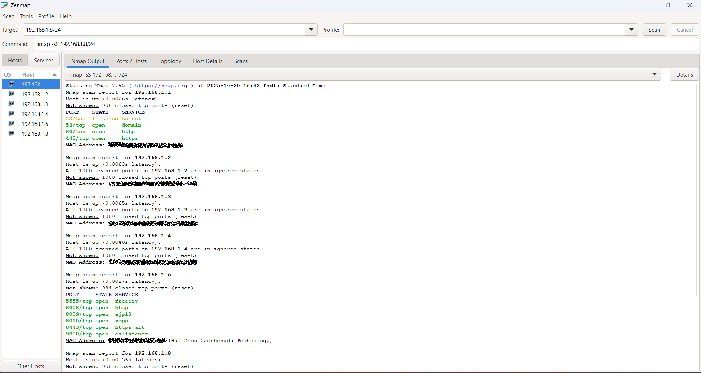
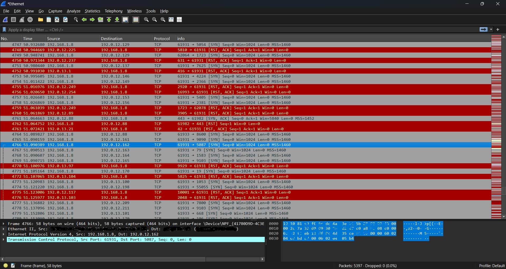

# Elevate-labs-Cybersecurity-Task-01
A repository for the task 01 from the Elevate labs, Cybersecurity

# Task 1 – Local Network Port Scanning

## Objective  
To identify open ports within a local network and assess potential security exposures.

**Date:** 20-10-2025  
**Author:** Charitardha Pulipati  
**Repository:** [GitHub repo link here]

---

## Tools Used  
- Nmap (required)  
- Wireshark (optional for packet analysis)  

---

## Methodology

1. **Determine local network IP range**  
   Example: 192.168.1.0/24  
   Actual used: 192.168.1.1/24  

2. **Perform a TCP SYN scan using Nmap**  
   Command used:  nmap -sS 192.168.1.1/24

3. **Analyze the output**  
- Number of active hosts: 6  
- List of IPs with open ports: 3  
- Common services detected: 80/tcp (http)  

4. **(Optional) Capture traffic using Wireshark**  
Capture file name: [Enter file name here]  
Observations: [Enter key findings here]  

---

## Results Summary

| IP Address  | Open Ports                                | Services                               | Security Risk Level  |
|-------------|------------------------------------------|--------------------------------------|---------------------|
| 192.168.1.1 | 23/tcp filtered, 53/tcp open, 80/tcp open, 443/tcp open | Telnet, domain, http, https           | [Low/Medium/High]    |
| 192.168.1.2 | Ports are in ignored state                |                                      |                     |
| 192.168.1.3 | Ports are in ignored state                |                                      |                     |
| 192.168.1.4 | Ports are in ignored state                |                                      |                     |
| 192.168.1.6 | 5555/tcp open, 8008/tcp open, 8009/tcp open, 8010/tcp open, 8443/tcp open, 9000/tcp open | Freeciv, http, ajp13, Xmpp, https-alt, cslistener |                     |
| 192.168.1.8 | 80/tcp open, 135/tcp open, 139/tcp open, 443/tcp open, 445/tcp open, 2179/tcp open, 3306/tcp open, 3580/tcp open, 5357/tcp open, 16992/tcp open | http, msrpc, netbios-ssn, https, microsoft-ds, vmrdp, mysql, nati-svrloc, Wsdapi, amt-soap-http |                     |

---

## Analysis  

Describe your interpretation of the results below:  
[Write 3–5 lines summarizing what your scan revealed, e.g., presence of exposed services, insecure configurations, etc.]

---

## Security Recommendations  

- Enable only the required ports.  
- Disable all unused or unwanted ports on systems.  
- Never share your network with unknown or untrusted people.  
- Configure firewall on the router.  

---

## Files Included  

- 'Nmap scan.txt` — raw scan output  
- `network_analysis.pcap` — optional Wireshark capture file  
- `README.md` — task documentation (this file)  
- `screenshots/` — evidence of commands & output (add images here)

---

## Screenshots  

Add your screenshots of Nmap and Wireshark commands and outputs in the `screenshots` folder. Reference them below:  

  
  

---

Feel free to update the placeholders with actual data and answers. This README structure is well-suited for professional GitHub submission and will clearly showcase your work and findings.
